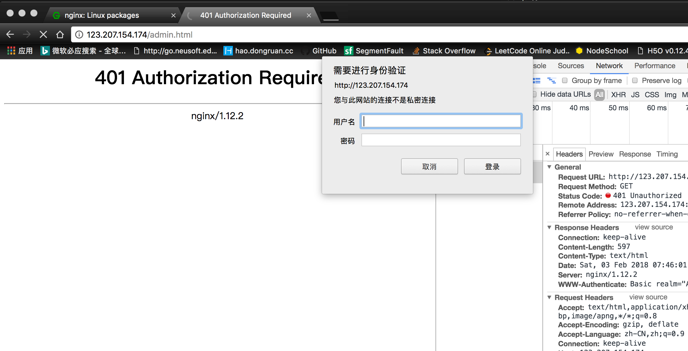

# nginx-base-conf

```bash
vi /etc/nginx/conf.d/default.conf
```
### 查看连接状态等
配置中添加
```bash
    location /mystatus {
        stub_status;
    }
```
访问 http://ip/mystatus


### 随机主页

```bash
    location / {
        root    /opt/app/code;
        random_index on;
        index  index.html index.htm;
    }
```
访问 http://ip


### 全局替换内容

```bash
    location / {
        root    /opt/app/code;
        index  index.html index.htm;
        sub_filter '<p>c' '<p> 替换后的内容 CCC';
        sub_filter_once off;
    }
```
访问 http://ip/yourself.html


### 频率限制

* 连接频率限制
```bash
    limit_conn_zone $binary_remote_addr zone=conn_zone:1m;

    location / {
        root    /opt/app/code;
        limit_conn conn_zone 1;
        index  index.html index.htm;
    }
```

* 请求频率限制
```bash
    limit_req_zone $binary_remote_addr zone=req_zone:1m rate=1r/s;

    location / {
        root    /opt/app/code;
        # limit_req zone=req_zone burst=3 nodelay;
        # limit_req zone=req_zone burst=3;
        # limit_req zone=req_zone;
        index  index.html index.htm;
    }
```

### ip 的访问控制

除了这个 ip 都可以访问
```bash
    location ~ /admin.html {
        root   /opt/app/code/;
        deny 182.201.211.62;
        allow all;
        index  index.html index.htm;
    }
```

除了这个 ip 都不可以访问
```bash
    location ~ /admin.html {
        root   /opt/app/code/;
        allow 182.201.211.62;        
        deny all;
        index  index.html index.htm;
    }
```

### 访问控制

输入用户名及密码

```bash
[root@VM_150_136_centos nginx]# htpasswd -c ./auth_conf botai
newpassword:
```
会在当前目录下生成一个 auth_conf,其中的内容
```bash
# 设置的用户名 botai 密码 123456
[root@VM_150_136_centos nginx]# more auth_conf
botai:$apr1$8S/eoJKQ$PmnYn5bqllMC/SjQbcUe3.
```

```bash
    location ~ /admin.html {
        root   /opt/app/code/;
        auth_basic "Auth access test!input your password";
        auth_basic_user_file /etc/nginx/auth_conf;
        index  index.html index.htm;
    }
```
输入正确会跳转,错误则返回401

访问 http://ip/admin.html



### 搭建静态资源服务器

```bash
    sendfile on;
    
    location ~ .*\.(jpg|gif|png)$ {
        gzip on;
        gzip_http_version 1.1;
        gzip_comp_level 2;
        gzip_types text/plain application/javascript application/x-javascript text/css application/xml text/javascript application/x-httpd-php image/jpeg image/gif image/png;

        root /opt/app/code/images;
    }

    location ~ .*\.(txt|xml)$ {
        gzip on;
        gzip_http_version 1.1;
        gzip_comp_level 1;
        gzip_types text/plain application/javascript application/x-javascript text/css application/xml text/javascript application/x-httpd-php image/jpeg image/gif image/png;

        root /opt/app/code/doc;
    }

    location ~ ^/download {
        gzip_static on;
        tcp_nopush on;

        root /opt/app/code;
    }

```

### 设置缓存
```bash
    location ~ .*\.(htm|html)$ {
        expires 24h;
        root /opt/app/code;
    }


```

### 设置跨域
```bash
    location /{
        add_header Access-Control-Allow-Origin http://rainbower.me;
        add_header Access-Control-Allow-Methods GET,POST,PUT,DELETE,OPTIONS;
        root /opt/app/code;
    }

```


### 配置 https

```bash
    server {
        listen       80 default;
        server_name _;

        # return 500;
        rewrite ^(.*) https://rainbower.me permanent;

    }

    server {
        listen 443;
        server_name rainbower.me; #填写绑定证书的域名

        ssl on;
        ssl_certificate ./conf.d/1_rainbower.me_bundle.crt;
        ssl_certificate_key ./conf.d/2_rainbower.me.key;
        ssl_session_timeout 5m;
        ssl_protocols TLSv1 TLSv1.1 TLSv1.2; #按照这个协议配置
        ssl_ciphers ECDHE-RSA-AES128-GCM-SHA256:HIGH:!aNULL:!MD5:!RC4:!DHE;#按照这个套件配置
        ssl_prefer_server_ciphers on;

        location / {
                root   /opt/app/code/;
                allow 123.244.153.84;
                deny all;
                index  index.html index.htm;
         }

    }

```